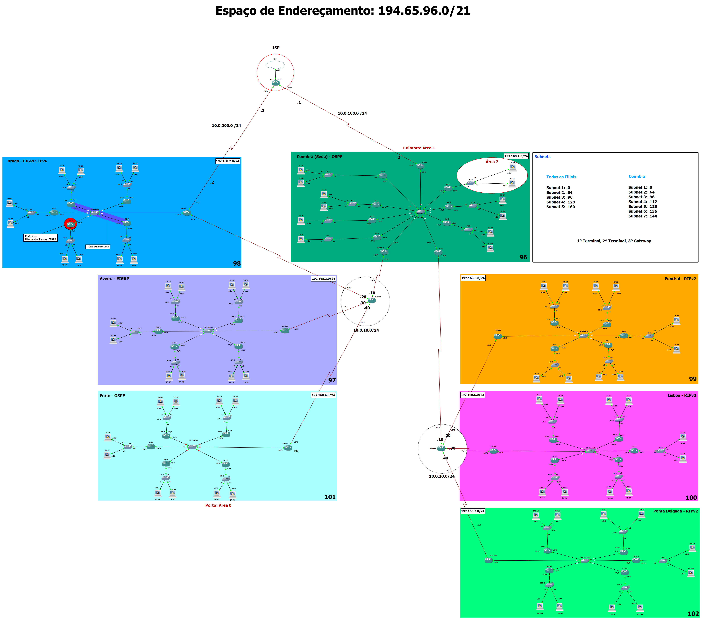

# Multi-Zone Network Routing Configuration


### **Project Overview**
This project demonstrates the design and implementation of a multi-zone network infrastructure using dynamic routing protocols such as OSPF, EIGRP, and RIPv2. The network consists of various branches distributed across different geographical zones, all interconnected through a central headquarters (HQ) in Coimbra.

The project integrates key networking concepts including Variable Length Subnet Masking (VLSM), policy-based routing, IPv6 tunneling, and redistribution between routing protocols. Additionally, a simulated Internet Service Provider (ISP) is included to ensure external connectivity.

## **Table of Contents**
- [Network Overview](#network-overview)
- [Key Features](#key-features)
- [Network Zones and Routing Protocols](#network-zones-and-routing-protocols)
- [Addressing Scheme](#addressing-scheme)
- [Routing Configuration](#routing-configuration)
- [IPv6 Integration](#ipv6-integration)
- [Security and Management](#security-and-management)
- [Connectivity Test](#connectivity-test)
- [Installation and Setup](#installation-and-setup)

## **Network Overview**
The network consists of 6 zones (Aveiro, Braga, Porto, Funchal, Lisbon, and Ponta Delgada) connected through a central HQ in Coimbra. Each branch operates with a different routing protocol depending on specific requirements, with controlled redistribution between zones to ensure seamless connectivity.

## **Key Features**
- **Dynamic Routing**: Utilizes OSPF, EIGRP, and RIPv2 across different zones.
- **VLSM Addressing**: Efficient IPv4 addressing using Variable Length Subnet Masking (VLSM) to optimize address allocation across subnets.
- **IPv6 Integration**: IPv6 dynamic tunneling is used between selected branches, ensuring future-proofing of the network.
- **Inter-Zone Redistribution**: Routing protocols are redistributed between zones to allow communication between branches running different protocols.
- **Security and Remote Access**: Configured for secure access via Telnet, with password encryption and single-session restrictions.
- **ISP Integration**: External connectivity is simulated with an ISP connection, using NAT and static routes for internet-facing access.

## **Network Zones and Routing Protocols**
| Branch        | Routing Protocol   |
|---------------|--------------------|
| Coimbra (HQ)  | OSPF               |
| Aveiro        | EIGRP              |
| Braga         | EIGRP              |
| Porto         | OSPF               |
| Funchal       | RIPv2              |
| Lisbon        | RIPv2              |
| Ponta Delgada | RIPv2              |

The network is divided into two areas connected via the HQ:
- **Zone 1**: Includes Porto, Braga, and Aveiro (OSPF and EIGRP)
- **Zone 2**: Includes Funchal, Lisbon, and Ponta Delgada (RIPv2)

## **Addressing Scheme**
The network uses the IPv4 address space: **194.65.96.0/21**.

### Example Subnet Addressing:
| Branch         | Subnet Mask   | First Usable IP  | Last Usable IP   | Broadcast Address |
|----------------|---------------|------------------|------------------|-------------------|
| Coimbra (HQ)   | /24           | 194.65.96.1      | 194.65.96.254    | 194.65.96.255      |
| Aveiro         | /24           | 194.65.97.1      | 194.65.97.254    | 194.65.97.255      |
| Braga          | /24           | 194.65.98.1      | 194.65.98.254    | 194.65.98.255      |
| Funchal        | /24           | 194.65.99.1      | 194.65.99.254    | 194.65.99.255      |
| Lisbon         | /24           | 194.65.100.1     | 194.65.100.254   | 194.65.100.255     |
| Porto          | /24           | 194.65.101.1     | 194.65.101.254   | 194.65.101.255     |
| Ponta Delgada  | /24           | 194.65.102.1     | 194.65.102.254   | 194.65.102.255     |

## **Routing Configuration**

### **OSPF**:
- **Coimbra HQ and Porto**: OSPF is configured across these zones, with Area 0 for backbone routing.
- **Virtual Links**: Virtual links are configured between remote areas (e.g., Braga and Aveiro) to ensure full OSPF functionality.

### **EIGRP**:
- **Braga and Aveiro**: EIGRP is implemented in these branches, using policy-based routing and prefix lists to filter specific routes and prevent unnecessary propagation.

### **RIPv2**:
- **Funchal, Lisbon, and Ponta Delgada**: These branches use RIPv2 for internal routing, with static routes configured for inter-zone communication.

## **IPv6 Integration**
- **Tunneling**: IPv6 dynamic tunnels are set up between Braga and Lisbon to allow for dual-stack operations in the future.

## **Security and Management**
- **Telnet Access**: Remote access is restricted to a single session using Telnet with password protection (password: `cisco`).
- **Password Encryption**: All configuration file passwords are encrypted for security.
- **Routing Protocol Authentication**: Routing protocols are secured using MD5 authentication where possible.

## **Connectivity Test**
Connectivity has been validated across all branches through successful pings from the Aveiro terminal to other branches, ensuring that routing and redistribution are functioning correctly.

## **Installation and Setup**
1. **Clone the Repository**:
   ```bash
   git clone https://github.com/LucasRibeiroCaetano/Routing-Network.git
   ```

2. **Import gns3 portable project**: Download the Gns3 protable project file and import it to gns3 in order to run the topology. 
---

